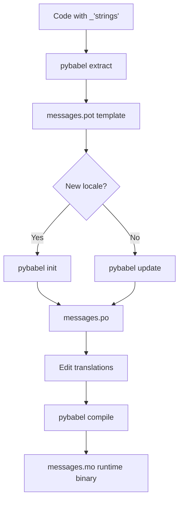

# Translation Workflow

This document explains how to extract, manage, and compile translations for NHL Scrabble.

## Initial Setup

Install i18n dependencies:

```bash
# Install with i18n support
uv pip install -e ".[i18n]"
```

## Extracting Strings

Extract all translatable strings from source code to POT template:

```bash
# Extract to messages.pot
pybabel extract -F babel.cfg -k _ -o messages.pot src/
```

This scans:

- All Python files for `_("string")` calls
- All Jinja2 templates for `` blocks and `{{ _("string") }}`

The generated `messages.pot` file is a template containing all translatable strings with empty translations.

## Creating Locale Files

Initialize translation for a new locale:

```bash
# Example: French Canadian
pybabel init -i messages.pot -d src/nhl_scrabble/locales -l fr_CA
```

This creates: `src/nhl_scrabble/locales/fr_CA/LC_MESSAGES/messages.po`

Repeat for each supported locale:

```bash
# All 12 supported locales
for locale in en_US en_CA fr_CA sv_SE ru_RU fi_FI cs_CZ de_DE de_CH it_CH sk_SK lv_LV; do
    pybabel init -i messages.pot -d src/nhl_scrabble/locales -l $locale
done
```

## Editing Translations

Edit the `.po` files to add translations:

```po
# src/nhl_scrabble/locales/fr_CA/LC_MESSAGES/messages.po
msgid "Analyzing NHL rosters..."
msgstr "Analyse des effectifs de la LNH..."

msgid "Team"
msgstr "Équipe"

msgid "Score"
msgstr "Score"
```

### Translation Tools

Use one of these tools to edit `.po` files:

- **Poedit**: GUI editor for .po files (https://poedit.net/)

  - Recommended for translators
  - Highlights untranslated strings
  - Validates translations

- **Weblate**: Web-based translation platform (https://weblate.org/)

  - Collaborative translation
  - Translation memory
  - Quality checks

- **Text Editor**: Any text editor

  - Simple for small changes
  - No special software needed
  - Requires manual validation

## Updating Translations

When code changes and new strings are added:

```bash
# 1. Extract new strings
pybabel extract -F babel.cfg -k _ -o messages.pot src/

# 2. Update all locale .po files
pybabel update -i messages.pot -d src/nhl_scrabble/locales
```

This:

- Adds new strings to all `.po` files
- Marks fuzzy translations that may need review
- Preserves existing translations
- Removes obsolete strings

## Compiling Translations

Compile `.po` files to binary `.mo` files for runtime use:

```bash
# Compile all locales
pybabel compile -d src/nhl_scrabble/locales
```

**Notes**:

- `.mo` files are generated from `.po` files
- `.mo` files should not be edited manually
- `.mo` files are required for translations to work at runtime
- Recompile after editing `.po` files

## Complete Workflow



Step-by-step:

1. **Extract**: `pybabel extract` - Scan code for translatable strings
1. **Initialize/Update**: `pybabel init` (new) or `pybabel update` (existing)
1. **Translate**: Edit `.po` files with translations
1. **Compile**: `pybabel compile` - Generate binary `.mo` files
1. **Test**: Run application in target locale

## File Structure

After setup, the structure looks like:

```
src/nhl_scrabble/
├── locales/
│   ├── en_US/
│   │   └── LC_MESSAGES/
│   │       ├── messages.po    # Translation source
│   │       └── messages.mo    # Compiled translations
│   ├── fr_CA/
│   │   └── LC_MESSAGES/
│   │       ├── messages.po
│   │       └── messages.mo
│   └── ... (other locales)
├── i18n.py                    # I18n utilities
└── ... (application code)
```

## Testing Translations

Test translations work correctly:

```bash
# Set locale via environment variable
export NHL_SCRABBLE_LANG=fr_CA
nhl-scrabble analyze

# Or pass as CLI option (once implemented)
nhl-scrabble analyze --locale fr_CA

# Test in Python
python3 << 'EOF'
from nhl_scrabble.i18n import get_translator
_ = get_translator("fr_CA")
print(_("Team"))  # Should print: Équipe
EOF
```

## CI/CD Integration

Translation compilation is automated in CI:

```yaml
# .github/workflows/ci.yml
- name: Install dependencies with i18n
  run: uv pip install -e ".[i18n]"

- name: Compile translations
  run: pybabel compile -d src/nhl_scrabble/locales
```

This ensures:

- `.mo` files are always up-to-date
- Translations work in deployed builds
- Missing translations don't break builds (graceful fallback)

## Best Practices

### For Developers

1. **Mark all user-facing strings** with `_()`:

   ```python
   # ❌ Bad
   print("Analyzing NHL rosters...")

   # ✅ Good
   from nhl_scrabble.i18n import get_translator

   _ = get_translator()
   print(_("Analyzing NHL rosters..."))
   ```

1. **Keep strings complete**:

   ```python
   # ❌ Bad (hard to translate)
   print(_("Found") + f" {count} " + _("teams"))

   # ✅ Good
   print(_("Found {count} teams").format(count=count))
   ```

1. **Extract and update regularly**:

   - Run `pybabel extract` after adding new strings
   - Run `pybabel update` to sync with translators
   - Commit `.po` files (not `.mo` files)

### For Translators

1. **Translate complete strings**:

   - Don't split translations mid-sentence
   - Preserve placeholders like `{count}`
   - Maintain capitalization and punctuation

1. **Context matters**:

   - Read surrounding code if unclear
   - Check how string is displayed (CLI, web, etc.)
   - Ask for context if ambiguous

1. **Test translations**:

   - Compile and run application in your locale
   - Verify strings fit in UI elements
   - Check for typos and grammar

1. **Use translation memory**:

   - Reuse consistent translations
   - Maintain terminology consistency
   - Document special terms

## Troubleshooting

### Translations Not Working

1. **Check .mo files exist**:

   ```bash
   find src/nhl_scrabble/locales -name "*.mo"
   ```

1. **Recompile translations**:

   ```bash
   pybabel compile -d src/nhl_scrabble/locales
   ```

1. **Verify locale code**:

   ```bash
   echo $NHL_SCRABBLE_LANG  # Should be en_US, fr_CA, etc.
   ```

### String Not Translating

1. **Check string is marked with `_()`** in code
1. **Extract and update**:
   ```bash
   pybabel extract -F babel.cfg -k _ -o messages.pot src/
   pybabel update -i messages.pot -d src/nhl_scrabble/locales
   ```
1. **Add translation** to `.po` file
1. **Recompile**:
   ```bash
   pybabel compile -d src/nhl_scrabble/locales
   ```

### Fuzzy Translations

Fuzzy translations are marked when pybabel detects string changes:

```po
#, fuzzy
msgid "Analyzing NHL rosters..."
msgstr "Analyse des effectifs de la LNH..."
```

- Review and update translation if needed
- Remove `#, fuzzy` comment when verified
- Fuzzy translations may not be used at runtime

## References

- **Babel Documentation**: https://babel.pocoo.org/
- **gettext Manual**: https://www.gnu.org/software/gettext/manual/
- **Poedit**: https://poedit.net/
- **Weblate**: https://weblate.org/
- **GNU gettext**: https://www.gnu.org/software/gettext/

## Support

For translation questions or issues:

1. Check this documentation first
1. Search existing GitHub issues
1. Open new issue with `i18n` label
1. Tag @bdperkin for assistance
